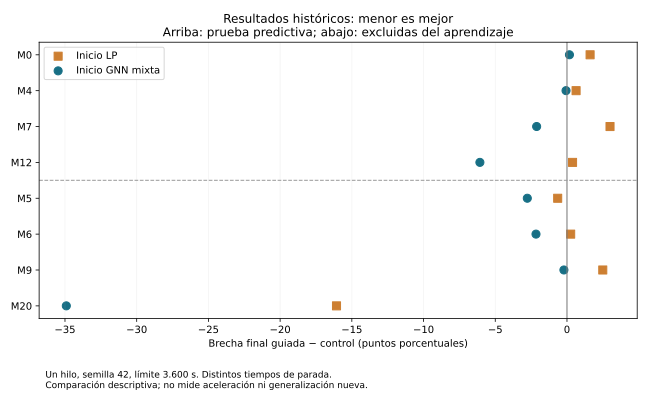

# E0 installed coverage review and frozen-model test inference

## What the installed return establishes

The immutable [coverage receipt](../evidence/e0/coverage.json) has SHA256
`ab949fc05dbab53c3aca48f3d78962006b44d624bc62a21a301f321278601c9b`.
The scan observed 1,891 entries, read 1,600,059 bytes, skipped no symlinks and
reported no recognized-file failures. It added zero optimizations or training.

The 50 candidates are **25 method receipts and 25 aggregate rows**, not 50 solves.
There are four plan observations but only three distinct plan files. Twenty-four
method receipts form eight complete historical trios, with matching within-parent
contract, MILP, mathematical signature and effective-parameter hashes. Their
primal, dual and final-gap values reproduce the published table. All 16 guided
receipts declare accepted starts. This reconciles metadata and published numbers;
it does not reread the solution binaries or independently verify feasibility.

The extra M0 control has contract
`a1baebc1f8f5daadf1231f22ba4c1025d7f33f4727d90ee16754302fdd42ad47`, with no matching
guidance plan in this receipt. It is retained in `excluded_control.csv`, never
substituted because it has a better gap. The paired M0 control uses contract
`94abd94ba3eb5d4023b95fc3009330073aad02f9232d018149af2498cf62a670`.

Eight parents still have no recognized method rows: F0/F3/F6/F14/F27/F29/M13/M26,
or 24 missing cells. This is bounded-scope absence, not proof of global absence.
No repeat of the collection or PR80 numerical audit is requested.

## Results already usable for descriptive discussion

The historical trios use the mixed checkpoint, seed 42, one Gurobi thread and a
3,600-second main-solve limit. Separate the four admitted medium test parents
(M0/M4/M7/M12) from four label-excluded, historically exposed parents
(M5/M6/M9/M20). The original canonical roles remain unchanged.

- Predictive-test stratum: GNN reduces final gap in 3/4; LP in 0/4.
- Label-excluded stratum observed here: GNN in 4/4; LP in 2/4.

Do not pool this into an unbiased population estimate or confuse it with the
older six-medium benchmark statistic, whose population differs. Smaller final
gap is not necessarily a better primal objective, and stopped/limited methods
do not have identical observation horizons. For example, M12's GNN receipt
reports gap zero while its primal is about 0.00045 higher than the LP incumbent;
that relative difference is below the configured MIPGap of 1e-4. Retain the
reported values and numerical-tolerance caveat; do not call this an exact
arithmetic optimality certificate or silently replace objectives.



The figure separates strata; negative guided-minus-control percentage points
favor guidance. CSVs retain full precision. The image is descriptive and has
no significance or speedup claim. Source code:
`scripts/evidence/review_e0_existing.py`. Regenerate into a new directory:

```bash
python -B scripts/evidence/review_e0_existing.py --output NEW_DIRECTORY --figures
```

The receipt does not contain solver version or root/preparation costs, and only
an allowlisted subset of the full parameter map is exported. Therefore these
receipts are **not admitted as contemporaneous controls for new runs**. The
published whole-map hash is retained. No automatic scientific promotion occurs.

## Next useful execution: test inference, not another diagnostic

Evaluate both existing, hash-bound checkpoints on all ten numerically admitted
test parents, preserving the original partition and frozen thresholds:

- F0, F3, F6, F14, F27, F29; M0, M4, M7, M12.
- 2 models x 10 parents = at most 20 forwards; no training or threshold tuning.
- Reuse the exact PR80 numerical receipt and verified graphs/root artifacts.
- Score labels only; they are not inputs to the GNN forward or start selection.
- Export private GNN probabilities and binary partial starts on HPC; transfer
  only aggregate metrics, timings, memory observations, runtime and hashes.
- Generate matched LP starts from **original root JSON values**, not their
  float32 feature copy. This explicit precision choice matches the historical
  PR58 selection input. It does not alter the GNN's audited float32 features.
- Roots are not reoptimized. Root-precomputation cost remains separately missing;
  do not report the resulting case timer as full end-to-end solver cost.

M13/M26 are not smuggled into this inference matrix: they are outside the 54
admitted parents and need their own label-free preparation before solver use.
The test set is historically exposed; no fresh-holdout or causal cohort claim.

### Budget and safety

One explicit operator submission, one node, four requested physical CPU cores,
32 GiB host RAM, one GPU, maximum 40 minutes. Sequential cases, Torch threads=1.
Slurm may account logical CPUs differently. CPU/GPU allocation is not measured
active device usage. No exclusive node, requeue, retry, environment update or
license use. The process timeout is 2,200 seconds; the job limit is 2,400 seconds.
Allocation/role/model/artifact mismatches stop. A case failure preserves outputs
and stops the remaining cases. No solver calls are present in this execution.

It extends the already exercised PR80 inference function via explicit arguments;
default PR80 validation cases remain unchanged. The plan binds the entire PR80
model metadata, not merely an architecture name. The installed return validates
20 unique cases, unchanged models, input hashes, support caps and confusion-derived
metrics. AUCs remain recorded evaluator values until private predictions are
independently rescored. There is one forward per case without repeated timing
trials; no GPU scaling/throughput claim follows from it.

### Operator steps

The handoff supplies the exact new head and installation commands. Do not use
the original `6798a5a` collection checkout to submit this new execution.
After snapshot installation and four passing exact-head evidence checks:

```bash
conda activate tfm_env
bash "$E0_STAGE/source/scripts/evidence/operate_e0_inference.sh" submit
# Returns immediately. Never repeat submit, including after an ambiguous reply.
bash "$E0_STAGE/source/scripts/evidence/operate_e0_inference.sh" status
# Once terminal, including a failed terminal state:
bash "$E0_STAGE/source/scripts/evidence/operate_e0_inference.sh" collect
```

`status` makes one query and never waits. `collect` preserves accounting and
packages one sanitized `public_return.json`. The local receiver
`receive_e0_inference.ps1` uses one SCP connection; incomplete returns are kept
for investigation, never retried automatically. Outputs of a complete review
include `test_inference.csv`; private predictions and starts stay on HPC.

## What remains in PR81 / E0

1. Review the twenty forwards and produce predictive/cost comparison figures.
2. Freeze the minimal missing-solve matrix, declaring model-specific arms,
   matched controls, root provenance, memory policy and total resource limits.
   The earlier 24-main-solve ceiling does not authorize multiplying two models
   by five CPU caps. Five caps remain the later E1/E2 requirement.
3. Execute admitted missing comparisons, retain unsuccessful outcomes and publish
   solver-quality/cost/acceptance tables and reproducible figures.
4. Mark ready only when the scoped delivery is complete; ask for merge then.

No new solver campaign, merge, re-training or 54-parent re-audit is authorized
by this review. Continue within PR81, not a new PR per operator helper.
