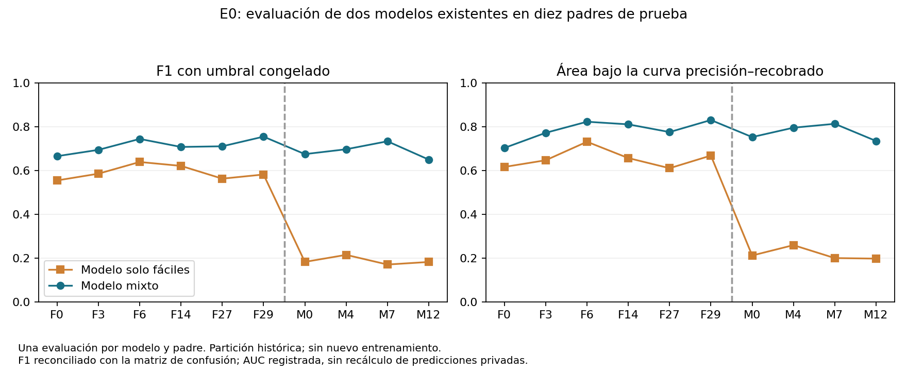
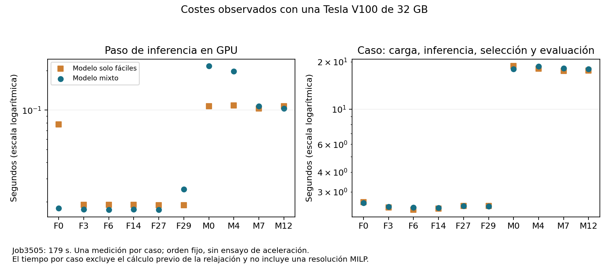

# E0: revisión del job3505 y continuación sin nuevo entrenamiento

## Qué se completó y cómo se verificó

El job3505 terminó correctamente en 179 s. Se revisaron los bytes originales
del retorno, SHA256 `8f8f0b3c9dc350422f7a36bdb6c46d338186274ebf629d14acb88ea0ecbf9c40`,
sus miembros internos y las veinte evaluaciones: dos modelos congelados por
diez padres de prueba. Se conservaron las seis fáciles F0, F3, F6, F14, F27,
F29 y las cuatro medias M0, M4, M7, M12. No se entrenó ni se llamó al solver.
El fallo previo del job3504 sigue preservado; no se confunde con esta ejecución.

`review_e0_job3505.py` reconstruye las tablas a partir del retorno versionado.
F1, precisión y recobrado se reconcilian con las matrices de confusión. El área
bajo la curva precisión-recobrado se toma del resultado registrado: no se afirma
un recálculo independiente desde las predicciones privadas. Los archivos y las
figuras están vinculados al retorno mediante `asset_hashes.json`.

## Resultados predictivos: cada padre tiene el mismo peso

| Estrato | Padres | F1 solo fáciles | F1 mixto | PR-AUC solo fáciles | PR-AUC mixto |
| --- | ---: | ---: | ---: | ---: | ---: |
| Fáciles | 6 | 0,5904 | 0,7123 | 0,6545 | 0,7852 |
| Medias | 4 | 0,1878 | 0,6883 | 0,2173 | 0,7735 |

F1 combina precisión y recobrado de las asignaciones positivas; mayor es mejor.
Son medias por padre, no una media que favorezca los grafos más grandes.
El modelo mixto obtuvo mayor F1 y PR-AUC en los diez padres. Es una comparación
descriptiva de modelos existentes: sus conjuntos de entrenamiento y costes no
son equivalentes. No demuestra causalidad, significación estadística, mejora
del Gurobi ni generalización a una nueva muestra intacta.

La fracción positiva agregada es aproximadamente 0,257% en fáciles y 0,0645%
en medias. Un clasificador que siempre predice cero tendría una exactitud
superior al 99%; por ello la exactitud no es el resultado principal.

## Configuración y coste computacional

Se reutilizó `tfm_env`: Python 3.10.20, PyTorch 2.1.2+cu121, CUDA de PyTorch
12.1, PyG 2.7.0, NumPy 1.26.4 y SciPy 1.15.3. Una Tesla V100-SXM2-32GB,
controlador 550.90.07; un hilo de PyTorch. Ambos modelos tienen dos capas con
dimensión oculta 32. Los checkpoints y sus hashes completos constan en el plan
y retorno. Umbrales congelados: fáciles 0,9975354671478271; mixto
0,9991843104362488. Semilla 42; no se activaron algoritmos deterministas,
por lo que no se promete identidad bit a bit entre plataformas.

| Estrato/modelo | Mediana forward GPU (s) | Mediana caso (s) | Máximo allocated GPU (GiB) |
| --- | ---: | ---: | ---: |
| Fáciles / solo fáciles | 0,01894 | 2,418 | 0,281 |
| Fáciles / mixto | 0,01747 | 2,416 | 0,281 |
| Medias / solo fáciles | 0,10721 | 17,785 | 2,161 |
| Medias / mixto | 0,15245 | 18,077 | 2,161 |

Una medición por caso, orden fijo, incluido un primer forward frío. El tiempo
de caso incluye carga, inferencia, selección y evaluación; excluye la relajación
precálculada y cualquier resolución MILP. No es un experimento de aceleración.
Slurm registró MaxRSS del batch de 2016312K; esta memoria de CPU tiene un ámbito
distinto de la memoria GPU asignada por PyTorch y no se equiparan.

Las versiones SVG/PDF/PNG y CSV están en
[job3505-results](../evidence/e0/job3505-results). Ningún resultado se convierte
automáticamente en evidencia final del artículo: el retorno conserva
`scientific_reporting_eligible=false`.

## Próximo paso útil: materializar los inicios existentes

La continuación mínima completa las seis fáciles que faltan en la tabla
histórica de tres métodos: sin inicio externo, inicio parcial de relajación
emparejado e inicio parcial de GNN mixta. Se usa el checkpoint mixto del protocolo
histórico PR58, no un modelo seleccionado retrospectivamente por ganar en estos
diez casos. El modelo solo-fáciles permanece en la comparación predictiva;
compararlo también en el solver requerirá enumerar sus brazos y controles.

`prepare_e0_easy_starts.py prepare` lee las predicciones privadas existentes del
job3505, comprueba los hashes de los MILPs originales y de las relajaciones
almacenadas y reproduce exactamente la selección GNN/LP (10%, máximo 20000
binarias, igual soporte y número de unos). Materializa los inicios privados y
exporta únicamente un manifiesto de hashes. No importa Gurobi ni ejecuta
inferencia, entrenamiento, consultas Slurm o nuevos jobs. Límite de lectura
4 GiB/240 s; el bloque operador añade timeout de 300 s. Si falla, preservar
el directorio: no repetir automáticamente.

Esto congela los insumos para el ejecutor protegido por memoria. No acredita
factibilidad ni aceptación de los inicios; eso se observará durante el solve.
El coste histórico de la relajación sigue desconocido y nunca se imputa como
cero. Debe separarse del tiempo de resolución antes de informar coste total.

La propuesta siguiente es **18 solves como máximo**, seis padres por tres
métodos, un hilo, semilla 42 y hasta 3600 s por solve: techo de 64800 segundos
de solver. No es una autorización ejecutable ni una nueva sumisión. M13/M26
requieren preparación sin etiquetas separada y no se incluyen en estos seis.
No se multiplica este bloque por dos modelos ni por cinco límites de hilos.
Los límites 1,2,4,8,16 siguen previstos para E1/E2.

## Cierre pendiente de la misma PR81

1. Recibir la vinculación de los seis padres; congelar parámetros y recursos
   del ejecutor, reutilizando las protecciones de memoria existentes.
2. Entregar un flujo no bloqueante para las resoluciones faltantes, con
   interrupción y sin retry automático; revisar los retornos.
3. Consolidar brechas, tiempos, aceptación de inicios y costes disponibles,
   conservando controles incompatibles como históricos descriptivos.
4. Actualizar tablas/figuras, completar CI, pasar a ready y solicitar merge.

No hacen falta nuevos entrenamientos para estas etapas. C2/C3, D, E1/E2 y F
mantienen el orden del [plan completo](mvp2-results-plan-20261009.md).
