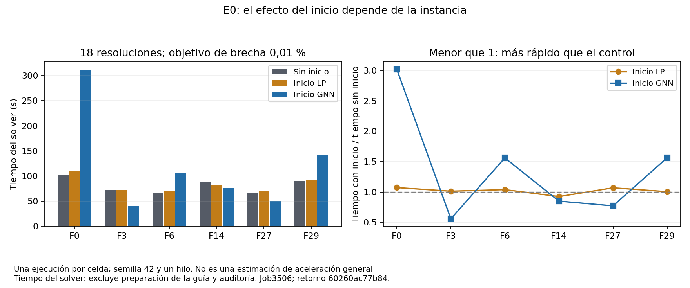
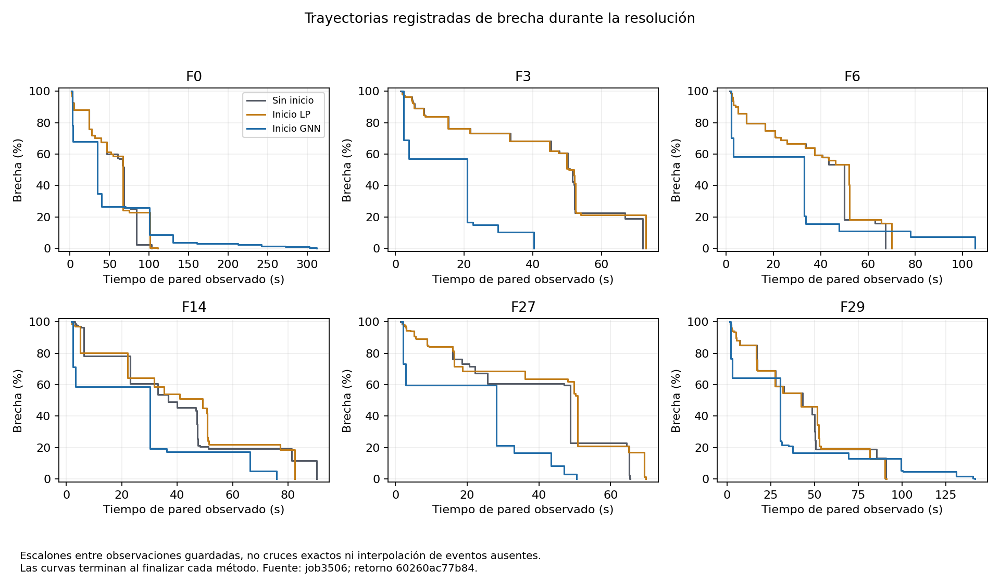
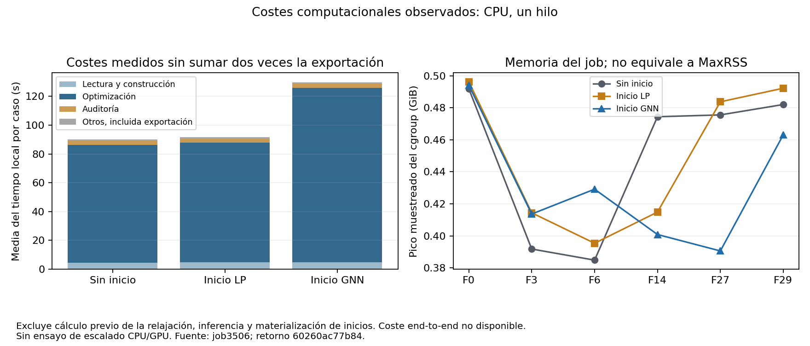

# E0: comparación de tres métodos en seis instancias fáciles

## Qué se completó, cómo y por qué

El job **3506** completó las **18 resoluciones previstas**, seis padres por tres
métodos, en **1886 s (31 min 26 s)**. Esta entrega pregunta si los inicios ya
producidos reducen el tiempo o mejoran la solución del Gurobi. No hubo nuevo
entrenamiento, inferencia ni cálculo de relajaciones. No se repite el piloto
CPU de F17/M1 ni se selecciona un modelo nuevo a partir del resultado del test.

El retorno original se conserva, sin reserialización, en
[`job3506-return.json`](../evidence/e0/job3506-return.json), SHA256
`60260ac77b84538316b725ac0d38033fd3c4afa29b056915085b9455f749cfce`.
El código ejecutado fue `15da78c928403a27201b831cb1b701cf4e145e8d`.
Se verifican el plan, sus fuentes congeladas, el manifiesto de inicios, las
firmas matemáticas emparejadas, parámetros, objetivos, brechas, tiempos y
contabilidad. La revisión no vuelve a ejecutar el solver.

Las auditorías independientes realizadas **en el HPC** aprobaron límites,
integralidad, restricciones y objetivo de los 18 incumbentes. Localmente se
reconcilian sus recibos y valores, no se releen las soluciones privadas. Los
hashes vinculan los logs cerrados y las soluciones con cada intento; el texto
privado de esos logs no se revisó ni se exportó en esta entrega.

## Muestra y contrato

F0, F3, F6, F14, F27 y F29 son los **seis padres fáciles del test histórico**,
no seis réplicas de una misma instancia ni una muestra nueva intacta. Los 54
padres de aprendizaje siguen admitidos; no cambia la partición 34/10/10.
Se compara el protocolo mixto histórico con un control nuevo para cada padre.

- Gurobi 13.0.1, Python 3.10.20, entorno `tfm_env` sin actualizaciones.
- `Threads=1`, `Seed=42`, `TimeLimit=3600`, `MIPGap=0.0001` (**0,01 %**).
- Mismo MILP original, minimización explícita en los tres brazos. Los archivos
  fuente declaran MAXIMIZE; la política MINIMIZE aplicada está registrada.
- LP y GNN: inicio parcial de binarias, 10 % del soporte (14520-14880
  asignaciones), mismo número de unos por padre (386-422), sin fijar cotas.
- LP: asignaciones construidas a partir de la relajación almacenada. GNN:
  asignaciones del checkpoint mixto congelado. El control no recibe inicio.
- CPU sin GPU, 64 GiB, sin retry/requeue. Límites: 48 GB decimales del solver,
  interrupción muestreada a 56 GiB y límite de RAM del kernel de hasta 64 GiB.

## Resultado principal: no hay una mejora uniforme

Los 18 retornos tienen estado Gurobi 2 (óptimo **según las tolerancias**), sin
censura por tiempo. Los tres métodos obtienen el mismo objetivo primal para
cada padre. Las pequeñas diferencias de brecha final son diferencias del
certificado dual, no de la calidad del incumbente. La brecha máxima es
**0,0088751 %**, inferior al objetivo de 0,01 %. No se afirma un gap exactamente
cero en los 18 casos.

| Padre | Sin inicio (s) | Inicio LP (s) | Inicio GNN (s) | GNN / control |
| --- | ---: | ---: | ---: | ---: |
| F0 | 103,30 | 110,77 | 312,15 | 3,022 |
| F3 | 72,09 | 73,04 | 40,26 | 0,559 |
| F6 | 67,48 | 70,09 | 105,35 | 1,561 |
| F14 | 89,18 | 82,48 | 75,79 | 0,850 |
| F27 | 65,41 | 69,89 | 50,49 | 0,772 |
| F29 | 90,82 | 91,30 | 141,93 | 1,563 |

La tabla usa `solver_runtime_seconds`. Una razón menor que uno favorece al
inicio. GNN reduce el tiempo en **3/6** padres y LP en **1/6**. La media
geométrica de las razones emparejadas es **1,1802** para GNN y **1,0192** para
LP: respectivamente, un 18,0 % y un 1,9 % más de tiempo en este resumen
descriptivo. No debe confundirse esta media con la razón de sumas ni con la
mediana de tiempos. Se mantienen todos los padres, incluido F0.

Los **12 inicios fueron registrados como aceptados y completados** por el
solver. La aceptación permite iniciar con una solución factible completada,
pero no garantiza una búsqueda más rápida. La mejora predictiva observada en
el job3505 no se traduce automáticamente en aceleración de la optimización.



## Cómo interpretar las trayectorias y los costes

La brecha común se recalcula como `abs(primal-dual)/abs(primal)`. Las curvas
muestran eventos guardados, no todos los callbacks: el registrador limita
algunos eventos MIP a intervalos de 30 s. Los tiempos al objetivo son primeras
**observaciones**, no cruces exactos. Se verifica su coherencia con los puntos
guardados; no se reconstruyen observaciones ausentes ni se integra la curva
como si fuera una trayectoria completa.



El reloj de callbacks es `perf_counter` desde antes de `optimize`, incluyendo
la marca previa a la llamada. `Gurobi.Runtime` es otro reloj/ámbito. La mayor
diferencia entre pared de optimize y Runtime fue **1,2506 s** (F14 control).
Por tanto, un callback puede aparecer después del Runtime informado sin estar
fuera de la llamada medida en pared. Se conservan ambos campos sin corregir
retrospectivamente sus valores.

Suma del tiempo del solver: **1711,824 s**. La contabilización Slurm informa
1886 s de pared, CPU total 31:12.572, `AllocCPUS=2` y MaxRSS del batch
`492380K`. El parámetro efectivo `Threads=1` está registrado en los 18 casos.
El código congelado exige afinidad a un procesador lógico antes de cada
ejecución, pero el retorno no exporta una medición de esa afinidad ni un
inventario topológico; no se presenta `AllocCPUS` como número de hilos usados.

El máximo de memoria cgroup muestreada fue **0,4962 GiB**, sin interrupciones
de recursos. Cgroup incluye memoria del grupo y procesos relacionados; MaxRSS
tiene otro ámbito y muestreo. No se reconcilian ni se suman como si fueran la
misma medida. Un pico muestreado no es una medida continua exacta.

La descomposición local suma lectura, construcción, optimize, auditoría y
otros. **Exportación ya está incluida en otros**: se informa por separado como
subconjunto y no se suma dos veces. El tiempo local excluye inferencia,
materialización de inicios y cálculo previo de la relajación. Este último es
desconocido, no cero; el coste total end-to-end permanece ausente.



## Reproducibilidad y límites de interpretación

Una ejecución por celda, una semilla, un hilo y orden fijo. Esta entrega no
estima variabilidad entre repeticiones, significación estadística, efecto
causal de la cohorte de entrenamiento ni escalado CPU/GPU. Se informan efectos
descriptivos del bloque completo. No se modifican umbrales, selección de
padres ni presupuesto para buscar un resultado favorable.

[`job3506-results`](../evidence/e0/job3506-results) contiene cinco CSV (por
método, resumen, efectos pareados, trayectoria y contabilidad), revisión JSON,
tres figuras SVG/PDF/PNG y hashes. Los CSV mantienen unidades en las columnas,
datos completos y valores ausentes vacíos. El recibo original conserva
`scientific_reporting_eligible=false`: no se altera esa puerta histórica ni se
promueven automáticamente todas las métricas al artículo.

Reproducir sin Gurobi ni Slurm, en un directorio de salida nuevo:

```bash
python -B scripts/evidence/review_e0_job3506.py --output outputs/job3506-review
# Añadir --figures con matplotlib disponible para regenerar SVG/PDF/PNG.
```

El revisor verifica únicamente los archivos declarados en el plan ejecutado,
permitiendo añadir este análisis sin cambiar el plan histórico. El operador
antiguo debe usarse desde su snapshot congelado, no desde un checkout que
incluya nuevos scripts. No hay motivo para repetir el job3506.

## Cierre de PR82 y continuación de Sprint C

PR81 fue integrada en `develop` mediante `183ce3e`; su auditoría, inferencia y
preparación están concluidas. La ejecución y estas tablas/figuras corresponden
a **PR82**, cerrando el bloque E0 de seis fáciles, no toda Sprint C ni toda la
cobertura inicialmente planteada para E0. Este documento sustituye las listas
anteriores que ubicaban todavía estas resoluciones en PR81.

Próxima entrega: resolver el alcance de **M13/M26**, padres medios excluidos
del aprendizaje y expuestos históricamente, mediante inventario focalizado de
artefactos existentes y preparación sin etiquetas. No son test intacto. No se
repetirán los seis fáciles ni se abrirá entrenamiento/DDP antes de ese balance.
C2/C3 conservan aprendizaje comparable y escalado GPU; D, E1/E2 (CPU 1/2/4/8/16)
y F mantienen el orden del [plan general](mvp2-results-plan-20261009.md).
La sincronización con `main` sigue reservada al final de Sprint C.
