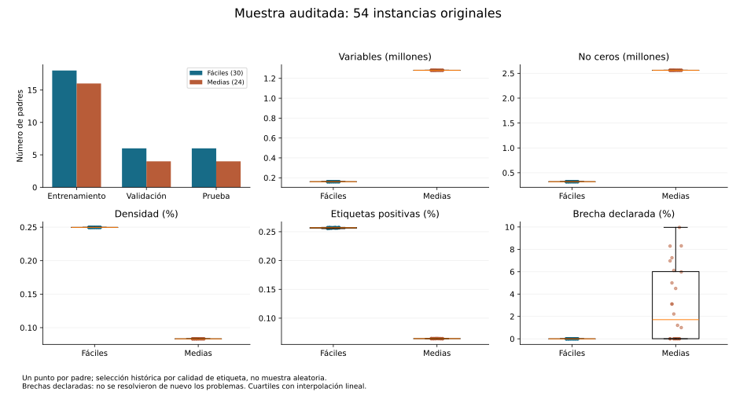
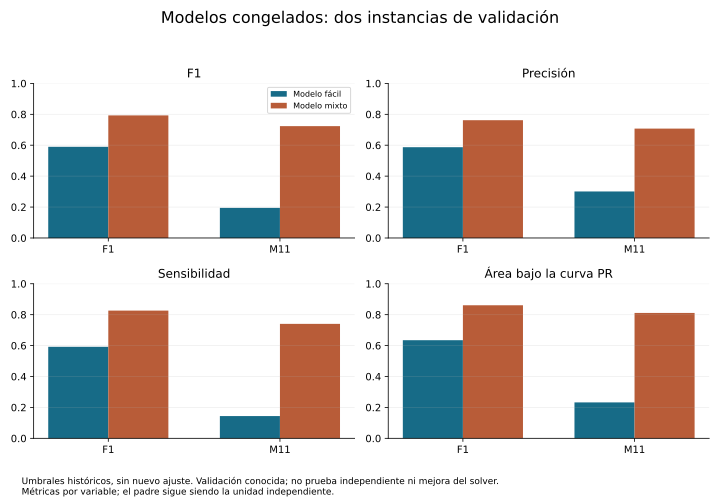
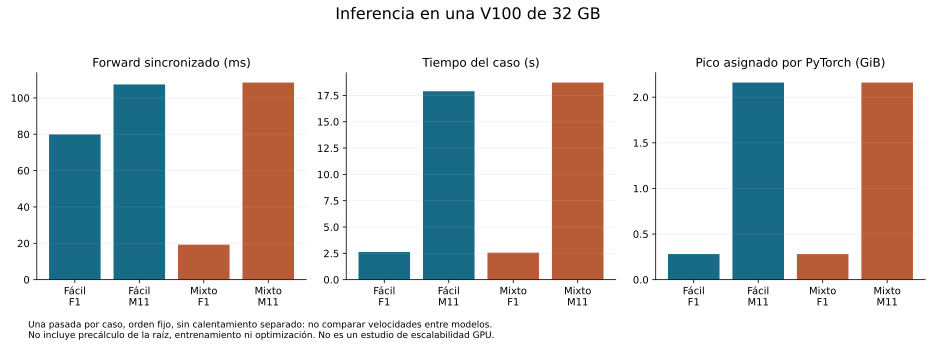
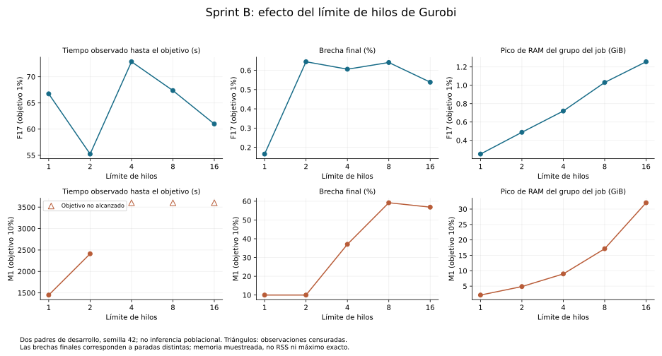

# PR80 closure review: 54 parents and four frozen-model forwards

Date: 9 October 2026. This is the current PR80 entry point. Earlier execution
instructions are historical; **do not submit the integrated job again**.
Job3503 completed in 508 seconds, exit 0:0, using the existing `tfm_env`.
The [original return](../evidence/pr80-job3503-return.json) is preserved with SHA256
`20ed978d7e6a9c0ccc6a284f15cf54c9df6940a0bc5985c1b836db5f69362f60`.
Runtime source: `1faa3491b0b5edcd07b4d6a6043bd7cc8b262f22`.

## What was verified

The [offline reviewer](../../scripts/evidence/review_pr80_job3503.py) verifies the
outer and six member hashes, exact selected parent/model identities, canonical
roles, feasibility checks, feature coverage and label gaps. It checks that the
39 reused numerical records are unchanged, that the remaining 15 passed, and
that the exported parent statistics agree with the numerical records. Confusion
counts independently reproduce precision, recall, F1 and accuracy. Nested
inference and runtime copies agree. There were zero new optimizations and zero
new training runs. The six generated tables are recorded in
[review.json](../evidence/pr80-results/review.json).

The installed 15 previously rejected labels all report lowercase `minimize`.
This confirms the historical-format incompatibility identified after Job3502.
No label, graph, mathematical tolerance, package or objective was changed.

Review boundaries: this is independent receipt reconciliation, not a second
numerical run. Graph/model bytes were read on HPC, not downloaded. Raw prediction
vectors and partial-start files remain on HPC; their hashes are in the return.
AUCs are the recorded evaluator outputs, not independently recomputed from
exported predictions. Partial-start acceptance/feasibility is not established.
Original `scientific_reporting_eligible=false` and `training_admitted=false`
flags remain immutable. This review supports the 54-parent C1 input admission;
it does not authorize a new training or solver campaign or claim generalization.

## Sample and representation

| Role | Easy | Medium | Total |
| --- | ---: | ---: | ---: |
| Training | 18 | 16 | 34 |
| Validation | 6 | 4 | 10 |
| Predictive test | 6 | 4 | 10 |
| Total numerically verified | 30 | 24 | 54 |

The easy-only cohort shares these same easy parents; it is not 30 additional
independent observations. The 54 are historically label-selected from the
90-original benchmark. Six other medium and all 30 hard parents remain outside
this learning sample. This is not a random sample of the benchmark.

All easy parents have 160,400 variables, 800 constraints and 320,400 nonzeros;
all admitted medium parents have 1,281,600 variables, 2,400 constraints and
2,561,600 nonzeros. Equal counts do not establish equal computational difficulty.
Feature dimensions remain 7 variable, 5 constraint and 1 edge channel, with
the historical deterministic encoding and root feature. No dimensionality
reduction or newly fitted transformation was introduced.

[Per-parent table](../evidence/pr80-results/sample_parents.csv) and
[descriptive statistics](../evidence/pr80-results/sample_summary.csv) include
counts, density, variable types, positive prevalence, declared gap, mean degrees
and clipping/infinite-entry counts, by difficulty and role. Quantiles are type 7;
missing observations are not zeros. Individual degree and transformed-coefficient
distributions were not exported and are not reconstructed from aggregate counts.
They remain a representation-analysis extension, not a claimed completed result.



## Frozen-model inference: initial findings, not an optimization comparison

| Validation parent | Model | Precision | Recall | F1 | PR-AUC |
| --- | --- | ---: | ---: | ---: | ---: |
| F1 | Easy-only | 0.5875 | 0.5921 | 0.5898 | 0.6349 |
| F1 | Mixed | 0.7621 | 0.8263 | 0.7929 | 0.8606 |
| M11 | Easy-only | 0.3008 | 0.1438 | 0.1946 | 0.2322 |
| M11 | Mixed | 0.7074 | 0.7403 | 0.7235 | 0.8111 |

F1 here is both an instance alias and a metric name; column headings distinguish
them. F1 score is the harmonic mean of precision and recall. PR-AUC summarizes
the precision-recall curve (not automatically equivalent to average precision).
Positive labels are rare, so accuracy above 99% alone is not persuasive evidence.

These are two known validation parents, not two newly untouched test instances.
Both cohorts use F1 for validation; the mixed cohort uses M11 in validation,
whereas the easy-only model transfers to a medium instance. Frozen model/threshold
selection used historical validation information. Thus the higher mixed-model
metrics are descriptive observations, not an unbiased causal training-cohort
comparison or a proof of better solver outcomes.

Both models retain two layers and hidden dimension 32. The exact frozen
thresholds are 0.9975354671478271 (easy) and 0.9991843104362488 (mixed).
Checkpoint hashes, plan/report hashes and training protocols are in the return.
No threshold selection, normalization fit or training occurred in this job.
Partial-start support was 14,840 for F1 and 20,000 for M11; no start was supplied
to a solver. [Full metrics](../evidence/pr80-results/inference_metrics.csv).



## Computational evidence

The four forwards used one Tesla V100-SXM2-32GB, Torch 2.1.2+cu121, CUDA build
12.1, cuDNN 8902, driver 550.90.07, Python 3.10.20 and PyG 2.7.0. Runtime versions
and deterministic settings are preserved; no bitwise reproducibility is claimed.
Observed forwards lasted about 19–108 ms, and case processing about 2.56–18.72 s.
The case timer includes graph/root reading, prediction and export/metrics work,
but not earlier model binding/loading, training or root precomputation.

There was one forward per case, in fixed order, without separate warm-up. The
timing difference on F1 must not be interpreted as mixed-model acceleration.
Peak GPU memory is PyTorch allocator memory, not whole-device or Slurm memory.
This is installed inference evidence on one GPU, not GPU-scaling evidence.



The [Sprint B CPU table](../evidence/pr80-results/sprint_b_cpu.csv) and chart reuse
the reviewed PR79 results, without new solves. F17 reached its 1% target at all
five thread caps; M1 reached 10% at caps 1 and 2. Caps 4/8/16 for M1 were
time-limited; their target times remain missing/censored, never replaced by 3600.
Final gaps have different stopping times. Sampled cgroup RAM, worker RSS and
Slurm MaxRSS are not interchangeable. This two-parent/one-seed development pilot
does not establish an optimal thread count for the population.



[Allocation costs](../evidence/pr80-results/sprint_b_allocation_costs.csv) count
jobs3489,3490,3494 once each, including interrupted3490. This is not a complete
cost ledger for every historical diagnostic. The new numerical audit similarly
spans jobs3501/3502/3503; job3503's 508 s is not the entire audit's cost.

## Reproduce locally, no HPC command

```bash
python -B scripts/evidence/review_pr80_job3503.py --output-directory NEW_DIRECTORY
python -B -m unittest discover -s tests/evidence -p test_pr80_job3503_review.py
# Optional: add --figures with matplotlib 3.9.2 in an existing plotting environment.
```

The reviewer never imports Torch, Gurobi or scheduler clients. Tables use stdlib
CSV and retain full numerical precision. Four figures are supplied in SVG/PDF/PNG,
with Spanish captions for the coauthor presentation; the plotting manifest records
the plotting version and file hashes. Image appearance may depend on font/library
versions. No HPC environment change is required to reproduce the tables.

## E0 handoff and PR80 acceptance

The [coverage table](../evidence/pr80-results/e0_published_coverage.csv) reconciles
the 10 predictive-test parents and six label-excluded medium parents against the
published MVP1 solver table. It finds 24 existing method rows and 24 absent rows:
six easy predictive-test parents (18 method rows) plus M13/M26 (6 method rows).
Absence from this published table does not prove absence from all HPC evidence.
Existing rows are historical, not automatically contemporaneous matched controls.

**E0's first action is targeted coverage/provenance reconciliation for these
eight parents, followed by a frozen admitted execution manifest.** Conditional
ceiling for missing coverage: 24 main solves at <=3600 s, plus at most 8 root
captures at <=600 s if absent; total solver-time ceiling <=91,200 s before
inference/overhead. These are planning ceilings, not submitted or approved jobs.
New parameter maps, memory guards and submission wall limits must be bound in
E0 before execution. A hard pilot is deferred to its own qualified expansion,
not included by this ceiling. No solver CLI is issued by this closure.

- [x] Review all 54 unique numerical parents, including the 15 remaining media.
- [x] Reconcile four frozen-model validation forwards and record interpretation limits.
- [x] Produce sample, inference, CPU and allocation tables and visual outputs.
- [x] Specify baseline representation and document unavailable richer distributions.
- [x] Reconcile published E0 coverage and define conditional next-step bounds.
- [x] Record the accepted C–F plan with figures/tables as delivery requirements.
- [ ] Exact final-head CI and ready-for-review transition.
- [ ] Separate human merge authorization.

Next: the [accepted delivery plan](mvp2-results-plan-20261009.md). Closing C1 does
not complete Sprint C, E0, the GPU study or the scientific submission.
